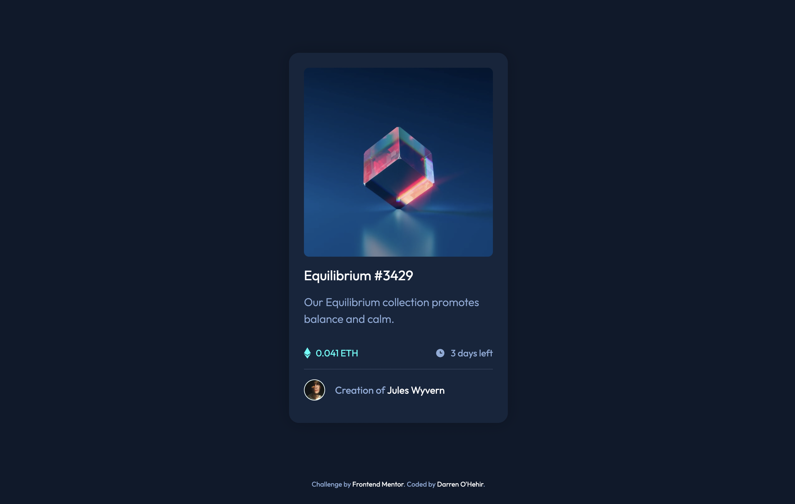

# Frontend Mentor - NFT preview card component solution

This is a solution to the [NFT preview card component challenge on Frontend Mentor](https://www.frontendmentor.io/challenges/nft-preview-card-component-SbdUL_w0U). Frontend Mentor challenges help you improve your coding skills by building realistic projects. 

## Table of contents

- [Overview](#overview)
  - [The challenge](#the-challenge)
  - [Screenshot](#screenshot)
  - [Links](#links)
- [My process](#my-process)
  - [Built with](#built-with)
  - [What I learned](#what-i-learned)
  - [Continued development](#continued-development)
  - [Useful resources](#useful-resources)
- [Author](#author)

## Overview

### The challenge

Users should be able to:

- View the optimal layout depending on their device's screen size
- See hover states for interactive elements

### Screenshot

### Links

- Solution URL: [Github repository](https://github.com/darrenohello/NFT-preview-card)
- Live Site URL: [Github demo](https://darrenohello.github.io/NFT-preview-card/)

## My process

### Built with

- Semantic HTML5 markup
- CSS custom properties
- Flexbox

### What I learned

I learned how to fade in an image overlay for the preview hover state.

### Continued development

I plan to continue learning how to use flexbox.

### Useful resources

- [How To - Image Hover Overlay](https://www.w3schools.com/howto/howto_css_image_overlay.asp) - This resource helped me learn how to do an overlay on hover.
- [Flexbox Guide](https://css-tricks.com/snippets/css/a-guide-to-flexbox/) - Referencing this is very helpful to make sure you're using the correct properties.

## Author

- Website - [Darren O'Hehir](https://darrenohehir.com/)
- Frontend Mentor - [@darrenohello](https://www.frontendmentor.io/profile/darrenohello)
- Twitter - [@darrenohehir](https://twitter.com/darrenohehir)
